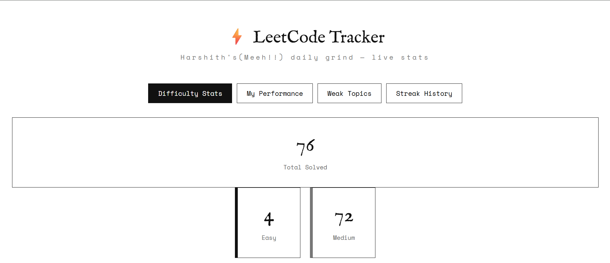
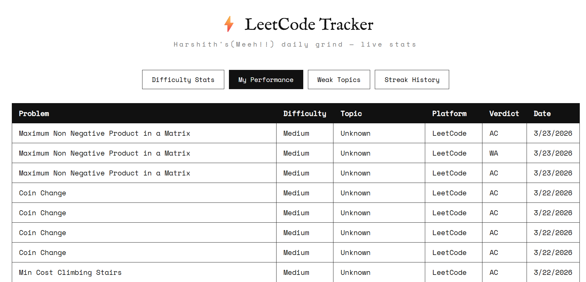
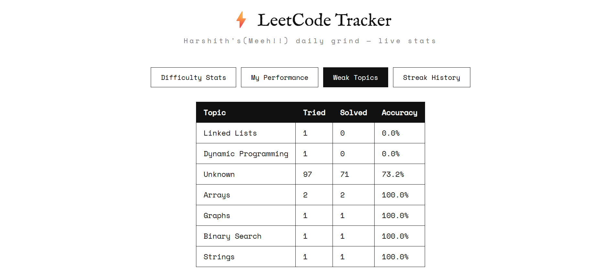

# ⚡ LeetCode Grind Tracker

> *"Every wrong submission is data. Might as well use it."*

A full-stack competitive programming tracker. Pulls LeetCode data, stores it in a MySQL database, and visualizes it through a web dashboard.

---

## Features

- Difficulty breakdown — Easy / Medium / Hard solved counts with clear rates
- Full submission history — verdicts, dates, platforms
- Weak topic analysis — sorted by accuracy
- Daily streak tracking

---

## Screenshots

### Difficulty Stats


### My Performance


### Weak Topics


### Streak History


---

## Architecture

```
LeetCode API
     ↓
sync.py  (Python — fetches, retries, inserts)
     ↓
MySQL  (cp_grind — 4 tables, 5 analytical views)
     ↓
fetch_views.php  (PHP — queries views, returns JSON)
     ↓
Frontend  (HTML + CSS + JS — four switchable tabs)
```

---

## Tech Stack

| Layer       | Technology                       |
|-------------|----------------------------------|
| Frontend    | HTML, CSS, Vanilla JavaScript    |
| Backend     | PHP                              |
| Database    | MySQL                            |
| Sync        | Python                           |
| Data Source | LeetCode via alfa-leetcode-api   |

---

## Database Schema

**Tables:**

| Table        | Purpose                              |
|--------------|--------------------------------------|
| `platforms`  | LeetCode, CodeChef, Codeforces       |
| `problems`   | Name, difficulty, topic, link        |
| `submissions`| Verdict, attempts, timestamp         |
| `daily_log`  | Solve count per day, streak status   |

**Views:**

| View               | What It Shows                                  |
|--------------------|------------------------------------------------|
| `difficulty_stats` | Attempted / cleared / clear rate by difficulty |
| `my_performance`   | Full submission history with platform & topic  |
| `weak_topics`      | Total tried, solved, accuracy % by topic       |
| `platform_stats`   | Win rate per platform                          |
| `streak_history`   | Daily solve count with streak status           |

---

## Project Structure

```
leetcode-grind-tracker/
├── frontend/
│   ├── index.html
│   ├── style.css
│   └── app.js
├── backend/
│   ├── fetch_views.php
│   └── sync.py
├── database/
│   ├── schemas.sql
│   ├── views.sql
│   └── queries.sql
└── assets/
    ├── difficulty-stats.png
    ├── my-performance.png
    ├── weak-topics.png
    └── streak-history.png
```

---

## Setup

**1. Clone**
```bash
git clone https://github.com/Harshith1702/leetcode-grind-tracker.git
cd leetcode-grind-tracker
```

**2. Create the database**
```sql
CREATE DATABASE cp_grind;
```
Then import:
```bash
mysql -u root -p cp_grind < database/schemas.sql
mysql -u root -p cp_grind < database/views.sql
```

**3. Update credentials**

In both `backend/sync.py` and `backend/fetch_views.php`:
```
host     = localhost
user     = root
password = your_password
database = cp_grind
```

**4. Sync LeetCode data**
```bash
python backend/sync.py
```

**5. Serve locally**

Place the project in your XAMPP `htdocs/` directory. Access via:
```
http://localhost/leetcode-grind-tracker/frontend/index.html
```

---

## How It Works

`sync.py` fetches the latest 50 submissions from the LeetCode API — with retry logic for rate limits — and inserts them into a normalized MySQL schema. SQL views aggregate the raw data into analytics. `fetch_views.php` queries those views and returns JSON. The frontend renders everything across four switchable tabs.

---

## Known Limitations

- The LeetCode API only returns the last 50 submissions — historical data beyond that isn't available
- Depends on external API availability and rate limits
- Topic classification defaults to `'Unknown'` until manually updated

---

## Planned Improvements

- Paginated submission history
- Chart.js visualizations
- Multi-platform support (Codeforces, CodeChef)
- Better topic classification
- User authentication

---

## Motivation

Built this to get a clearer picture of my competitive programming progress — difficulty distribution, weak topics, and streaks — in one place.

---

## Author

**Harshith** — CSE Undergraduate. Backend & systems focus.  
[github.com/Harshith1702](https://github.com/Harshith1702)
