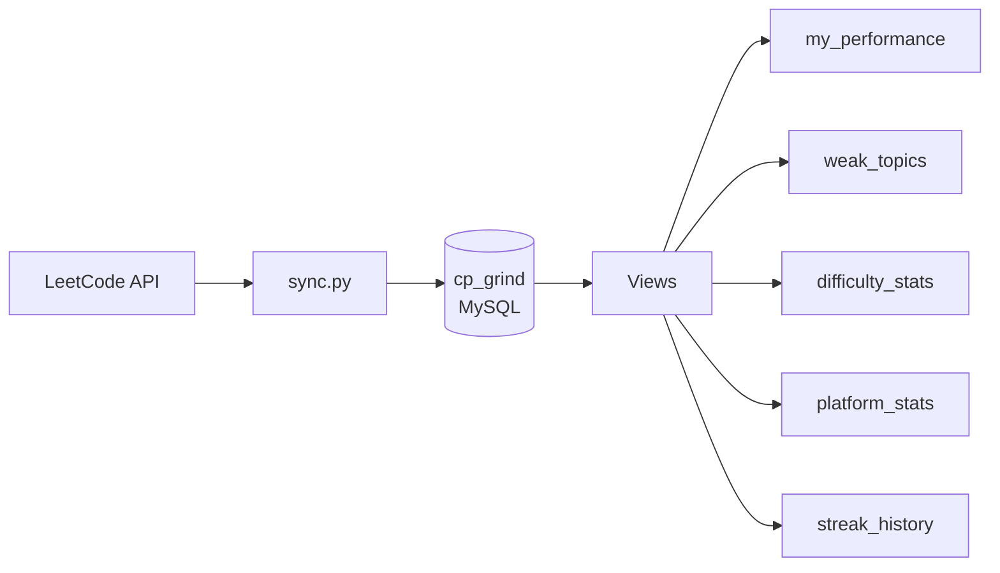
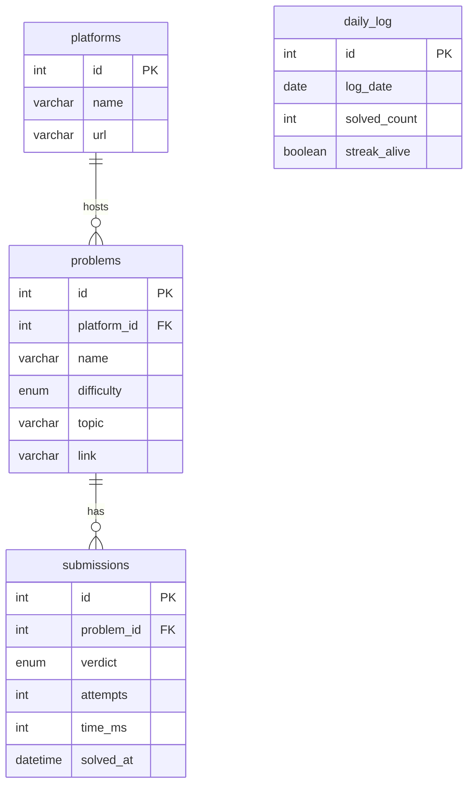

# CP Grind Tracker 🖤

I got tired of not knowing where I was dying on LeetCode. So I built a database that tracks every submission, shows my weak topics, and tells me if my streak is alive or dead.

319 problems in. Still suffering. But at least now it's documented.

## How It Works


## ER Diagram


## Tables

| Table | What It Stores |
|-------|---------------|
| platforms | LeetCode, CodeChef, Codeforces |
| problems | Every problem I've touched |
| submissions | Every attempt — AC, WA, TLE, MLE |
| daily_log | How many I solved each day, streak alive or dead |

## Views

| View | What It Shows |
|------|--------------|
| my_performance | Full history, latest first |
| weak_topics | Topics by accuracy — worst first. Hurts. |
| platform_stats | Win rate per platform |
| difficulty_stats | Easy / Medium / Hard breakdown |
| streak_history | Day by day grind log |

## How To Run

**1. Setup the Database**
```sql
-- Open MySQL Workbench, run schemas.sql then views.sql
```

**2. Install Dependencies**
```
pip install requests mysql-connector-python
```

**3. Add Your MySQL Password in sync.py**
```python
password="your_password_here"
```

**4. Sync Your LeetCode Data**
```
python sync.py
```

**5. See Your Data**
```sql
mysql -u root -p
USE cp_grind;
SELECT * FROM my_performance;
SELECT * FROM weak_topics;
SELECT * FROM difficulty_stats;
SELECT * FROM platform_stats;
SELECT * FROM streak_history;
```

## Project Files
```
cp-grind-tracker/
├── schemas.sql   — 4 tables, foreign keys, sample data
├── views.sql     — 5 views with joins and aggregations
├── queries.sql   — queries to run during demo
└── sync.py       — hits LeetCode API, dumps into MySQL
```

## Stack

- MySQL 8.0
- Python 3
- alfa-leetcode-api

---
Built by [Harshith](https://github.com/Harshith1702) — CMR Technical Campus 🖤
